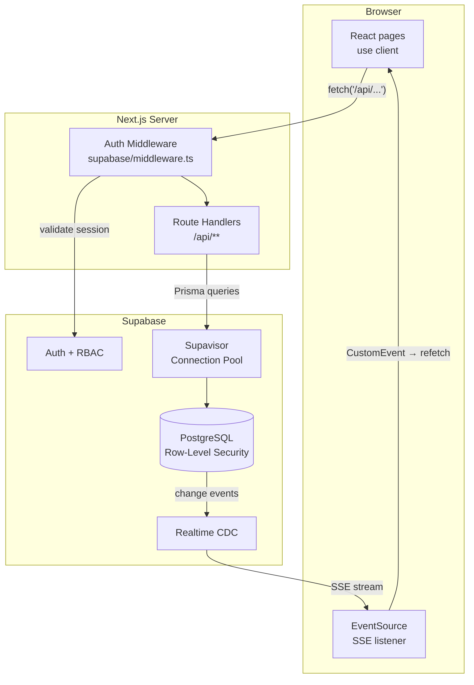
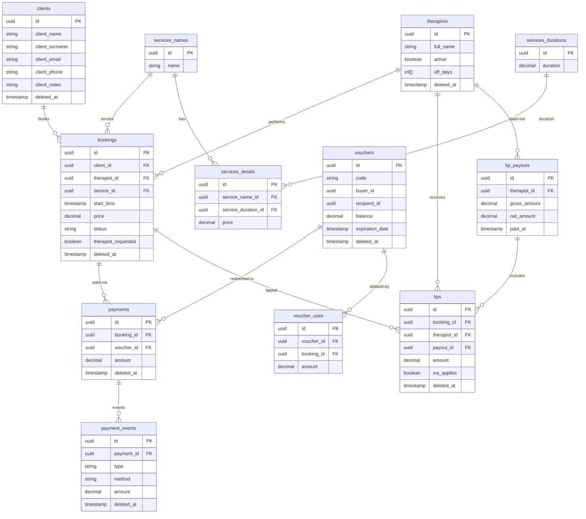
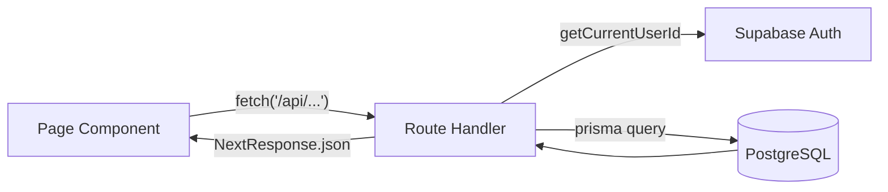
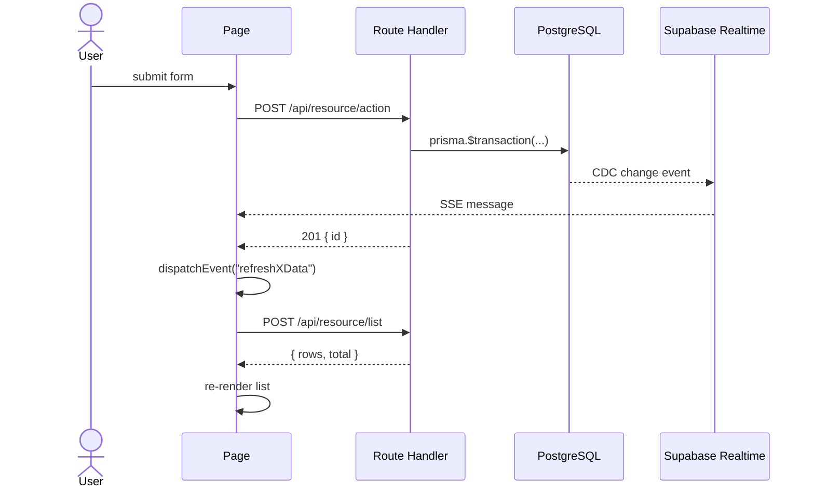
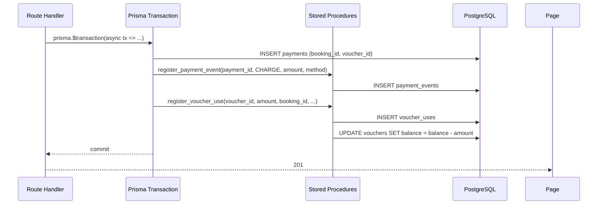

# Relaxzy Booking

Production booking management system for a massage therapy business. Handles the full operational lifecycle: scheduling, client management, service catalog, payments, gift vouchers, therapist tips, and end-of-day reconciliation — in three languages.

---

## Modules

| Module | What it does |
|---|---|
| **Calendar** | Day / week / agenda views with per-therapist lanes and live booking status |
| **Bookings** | Full booking lifecycle — create, update, cancel; therapist assignment; requested-therapist flag |
| **Clients** | Client directory with notes; fuzzy per-field autocomplete on all intake forms |
| **Payments** | Event-sourced ledger (CHARGE / REFUND); cash and card; running balance shown in real time |
| **Vouchers** | Gift vouchers with buyer + recipient contacts; balance tracked via stored procedures; code-based redemption at checkout |
| **Tips** | Per-booking tips with IVA tracking; payout dashboard for releasing accumulated tips to therapists |
| **Services** | Service catalog with duration × price matrix |
| **Therapists** | Team profiles; off-days configuration; booking and tip history |
| **Stats** | Revenue, bookings, clients, tips, and therapist hours — filterable by date range |
| **Guidelines** | Role-scoped knowledge base for staff (admin / receptionist / therapist) |

---

## Stack

| Layer | Choice | Why |
|---|---|---|
| Framework | Next.js 16 App Router | Edge-ready, SSR auth middleware, file-based API routes |
| UI | MUI v7 + Tailwind v4 | Component library for complex forms; utility classes for layout |
| Forms | react-hook-form + zod | Schema-first validation; `superRefine` for cross-field invariants |
| ORM | Prisma + `@prisma/adapter-pg` | Type-safe queries; native `pg` adapter for connection pooling |
| Database | PostgreSQL via Supabase | Row-level security; Realtime CDC; Supavisor connection pooler |
| Auth | Supabase SSR | Cookie-based sessions; role metadata for RBAC |
| i18n | next-intl | English, Spanish, Thai |

---

## Architecture

### System overview



### Data model

Core entities only — every entity also has a corresponding `_history` table written by database triggers for full audit trails.



### Request flow

All pages are `"use client"` components. There are no React Server Components fetching data — every load is a client-initiated `fetch()` to an API route, keeping the rendering model simple and predictable.



### Real-time update flow

After any successful write, the route handler dispatches a `CustomEvent` on `window`. List pages subscribe to both that event and to a Server-Sent Events stream (backed by Supabase Realtime) for cross-tab and cross-client consistency.



### Payment and voucher ledger

Payments use an append-only event ledger — the `payments` row links a booking to a payment instrument; `payment_events` rows record every CHARGE and REFUND. A booking's effective paid amount is always derived from summing events, never from a mutable column.

When a voucher is used at checkout, two stored procedures execute inside one `prisma.$transaction`, ensuring atomicity across both the payment ledger and the voucher balance:



Money comparisons throughout the payment flow use integer-cent arithmetic to eliminate floating-point drift.

---

## Engineering decisions

**Financial correctness** — All monetary columns are `numeric(10,2)`. Payment balance validation converts to integer cents before comparison. Voucher balance mutations are exclusively owned by `register_voucher_use` — no direct column updates anywhere in the application layer.

**Audit trail** — Every core entity (`bookings`, `clients`, `vouchers`, `payments`, `tips`, `therapists`, `services`) has a corresponding `_history` table populated by database triggers on INSERT / UPDATE / DELETE. The application layer never writes history — the database guarantees it.

**Connection management** — Prisma uses `@prisma/adapter-pg` with Supabase's Supavisor pooler (`DATABASE_URL`) at runtime. The direct connection (`DIRECT_URL`) is reserved solely for `prisma migrate` and `prisma db pull`. This avoids exhausting the 15-connection hard cap on direct PostgreSQL sessions.

**Client search** — The fuzzy autocomplete on booking and voucher intake forms runs a per-focused-field query against trigram GIN indexes on `client_name`, `client_email`, and `client_phone`. Results are ranked by overlap across the other fields so the most contextually relevant client surfaces first. Searches are debounced at 400 ms.

**Double-submit prevention** — `useSubmitGuard` combines a `useRef` (synchronous guard, fires before state renders) with a `useState` flag (disables the submit button in the UI). Both guards are needed: `useRef` catches rapid re-clicks within the same render cycle; `useState` handles the visual feedback and async duration.

**Schema-level cross-field validation** — Zod `superRefine` enforces invariants that span multiple fields: a client on a booking requires name plus either phone or email; a payment cannot exceed the booking's remaining balance; a voucher recipient requires the same contact completeness as a buyer.

**Role-based access** — User roles (`admin`, `receptionist`, `therapist`) are stored in Supabase auth metadata and read server-side via `getCurrentUserRole()`. Auth middleware validates the session and redirects unauthenticated requests to `/login` before any route handler executes.

**Soft deletes** — `deleted_at IS NULL` is the active-record predicate on every entity. Partial unique indexes enforce uniqueness constraints (e.g. `client_email`, `client_phone`) only among active records, so deleted contacts do not block re-registration.

---

## Project structure

```
src/
├── app/
│   ├── api/               # Route handlers (bookings, clients, payments, vouchers, tips, stats, …)
│   ├── bookings/          # Booking list + calendar
│   ├── calendar/          # Day / week / agenda calendar view
│   ├── clients/           # Client directory
│   ├── payments/          # Payment transaction history
│   ├── vouchers/          # Voucher issuance and redemption
│   ├── tips/              # Tip payout dashboard
│   ├── stats/             # Analytics
│   ├── guidelines/        # Role-scoped staff knowledge base
│   └── context/           # LayoutContext, theme, error boundary
├── hooks/                 # useCalendarData, useClientSearch, useSubmitGuard, useRole, …
├── schemas/               # Zod schemas for every form (booking, payment, voucher, tip, …)
├── handlers/              # Client-side submit handlers (thin fetch wrappers)
├── utils/                 # Money formatting, phone validation, date helpers, Supabase clients
├── lib/
│   ├── prisma.ts          # Singleton PrismaClient with PrismaPg adapter
│   └── auth/              # getCurrentUserId, getCurrentUserRole
└── constants/             # FETCH_LIMIT, STATUS_COLORS, default service catalog values
messages/
├── en.json                # English (22 namespaces)
├── es.json                # Spanish
└── th.json                # Thai
prisma/
├── schema.prisma          # Prisma schema (generated client → generated/prisma)
└── views/                 # PostgreSQL views (bookings_with_details, payments_summary, …)
```

---

## Local development

### Prerequisites

- Node.js 20+
- A Supabase project with the schema applied

### Setup

```bash
npm install
```

Create `.env.local`:

```env
# Supavisor pooled connection — Prisma runtime
DATABASE_URL=postgresql://...

# Direct connection — migrations only (prisma migrate / db pull)
DIRECT_URL=postgresql://...

NEXT_PUBLIC_SUPABASE_URL=https://<project>.supabase.co
NEXT_PUBLIC_SUPABASE_ANON_KEY=<anon-key>
SUPABASE_URL=https://<project>.supabase.co
SUPABASE_SERVICE_ROLE_KEY=<service-role-key>
```

### Commands

```bash
npm run dev        # Dev server (Turbopack)
npm run build      # Production build
npm run typecheck  # tsc --noEmit — run after every change
npm run lint       # ESLint
```
